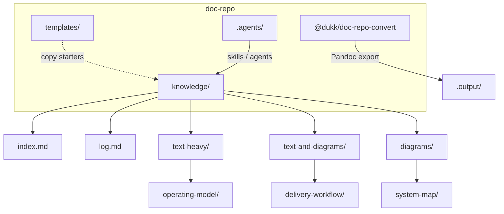
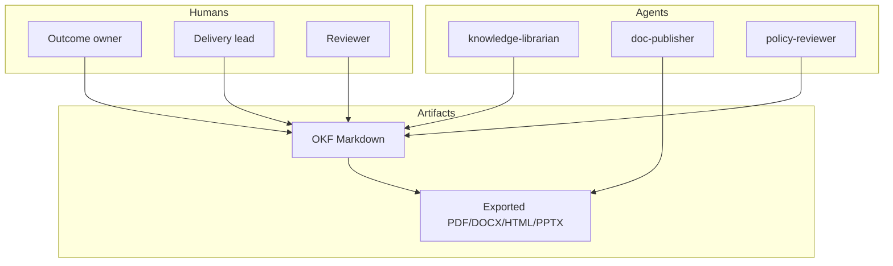
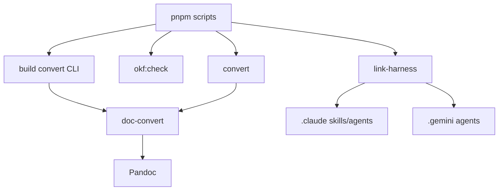
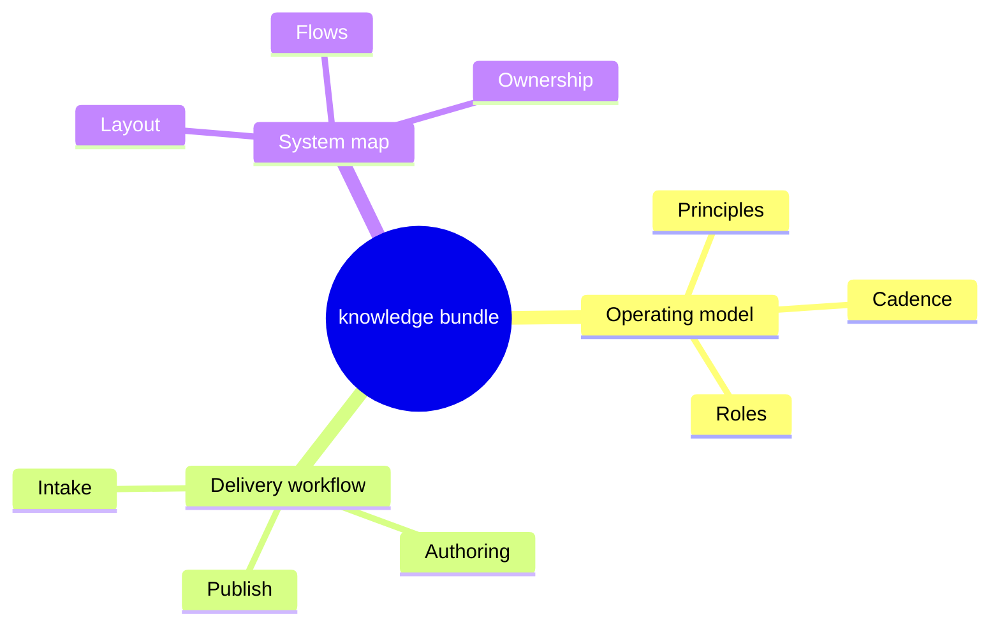

# Purpose

Diagram-first sample. Captions are short; the maps carry the meaning. Pair with [Operating model](/text-heavy/operating-model/document.md) and [Delivery workflow](/text-and-diagrams/delivery-workflow/) when you need narrative detail.

# Bundle layout

# Author → publish flow

# Ownership boundaries

# Tooling graph

# Concept relationships

# Captions only

| Diagram | Read it as |
|---------|------------|
| Bundle layout | Where source truth and tooling live |
| Author → publish | Minimum path from edit to optional export |
| Ownership | Who may change Markdown vs who prepares exports |
| Tooling | How pnpm scripts connect to Pandoc and harness links |
| Concept relationships | How the three samples reinforce each other |
