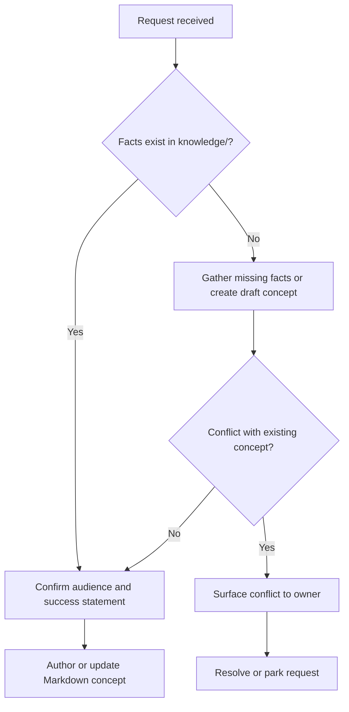

# Intake

Capture the request before drafting:

- desired audience (`internal` or `client`)
- success statement in one sentence
- source facts that already exist in `knowledge/`
- deadline and export formats (if any)

If the request conflicts with an existing concept, stop and surface the conflict. Do not draft around it quietly.

