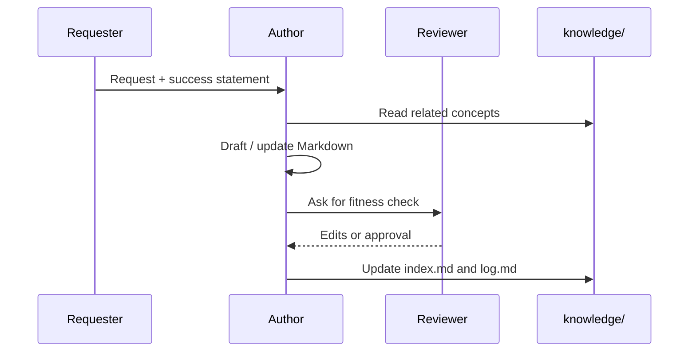

# Authoring

1. Copy a starter package from `templates/<type>/`.
2. Place it under `knowledge/<category>/<slug>/`.
3. Edit `document.md` (or grouped sources) and `convert.yaml`.
4. Write the body for the intended audience.
5. Link related concepts with bundle-relative paths.

