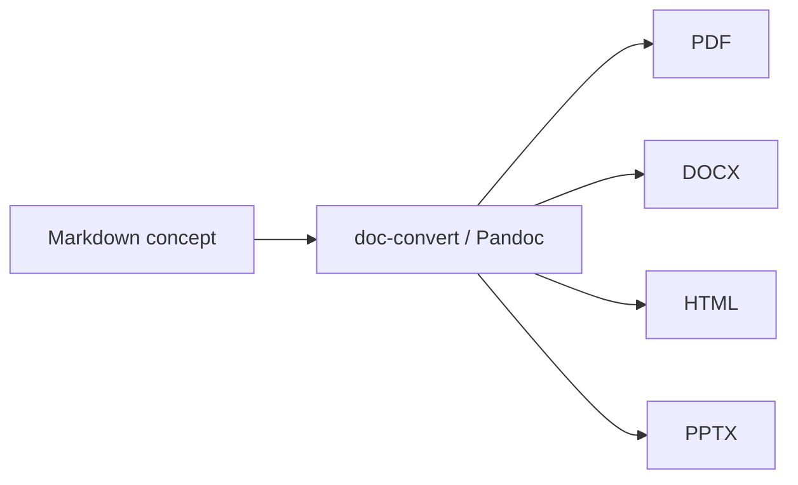

# Review checklist

- Frontmatter `type` is present and meaningful
- Claims match related concepts (or conflicts are noted)
- Links resolve
- Audience matches the export plan
- `index.md` / `log.md` updated when structure changed

# Publish (optional)

When a client-ready artifact is needed:

```bash
pnpm convert knowledge/text-and-diagrams/delivery-workflow
```

Supported formats: `pdf`, `docx`, `html`, `pptx`.



# Done when

- The concept is merged into `knowledge/`
- Reviewer approval is recorded (or explicitly waived)
- Exports, if requested, exist under the package `.output/` and are not committed
